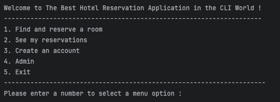

# Hotel Room Reservation System

This application System is an Java console based application.
The topics covered while working on this project include developing classes using Object-Oriented Programming (OOP), organizing and processing data with collections, utilizing common Java types, managing third-party libraries & mocking dependencies. This application enables users to locate and book a room at the hotel by considering the availability of rooms.



## Cloning

Using HTTPS:
```
git clone https://github.com/prafulbcr7/Hotel_Room_Reservation_System.git
```


### Running

1. Direct through the file
```
src/main/project/MainMenuApplication.java
```
2. Compile
```
javac MainMenuApplication.java
```
3. Run
```
java MainMenuApplication.java
```

